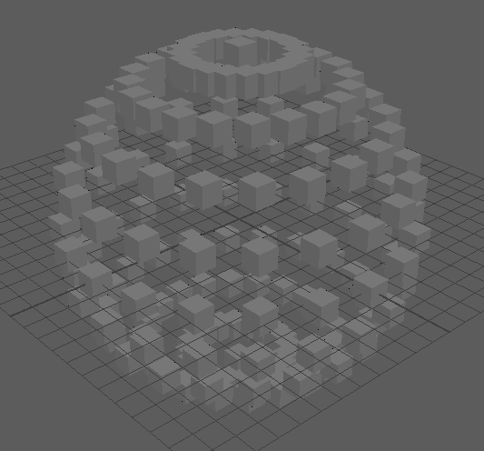

# Assignment 2

## Description

- This script creates a parametric sphere out of default cubes.
- 

## Arguments

- radius: Radius of the generated sphere.
- step_size: Size of each step around sphere in degrees. A higher value yields a lower
  resolution.,

## Example

- `mayapy .\parametric_sphere_generator.py`: Uses default values `radius=5`
  and `step_size=24`.
- `mayapy .\parametric_sphere_generator.py -radius 50 -step_size 30`