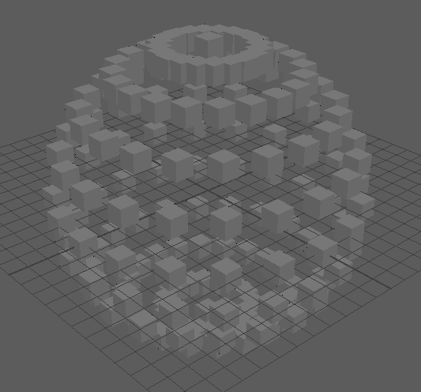
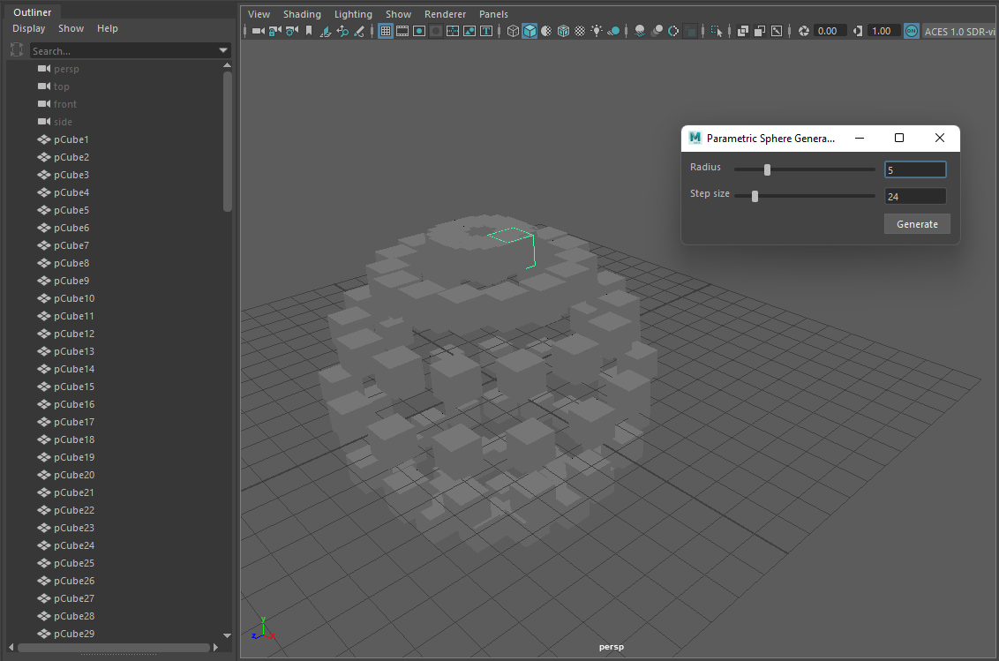

# Assignment 5

## Description

- This script creates a parametric sphere out of default cubes.
- 

## Buttons

- `Radius slider`: Sets the radius of the sphere
- `Step size slider`: Size of each step around sphere in degrees. A higher value yields
  a lower resolution.
- `Generate`: Generates a sphere of cubes with the given radius and step size.

## Example

- 