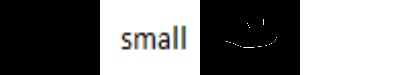

# ANIM T380 - Midterm

## Broken Frame Analyzer

### Description

- This script analyzes a directory for broken frames. It checks for the following
  qualities:
    - Dark/ black frames
    - Frames with small files sizes

### Dependencies

- Found in `requirements.txt`.
    - Pip installing `opencv-python` and `numpy` should satisfy everything.
- A venv is provided with all packages included. To run it unzip `venv.zip` and
  type `source venv/bin/activate`.
    - Then type `python python/brokenFrames.py -h` for help.

### Arguments

Positional arguments:

- `frames_dir` - Path to directory of frames

Optional arguments:

- `value_thresh` - Threshold of value for dark frames
    - Ex. `--value_thresh 0.0` gives warnings for completely black frames.
    - Ex. `--value_thresh 0.01` gives warnings for frames with an average value of 1%.
- `size_thresh` - Threshold of file size in MB.
    - Ex. `--size_thresh 20` gives warnings for frames below 20MB.
- Filter frame name depending on naming convention set in `naming.txt`. Can filter a
  single value or a range.
    - Ex. If `naming.txt` is set as `scene_shot_frame.png` then the optional parameters
      are:
        - `--scene #-#`
        - `--shot #-#`
        - `--frame #-#`
        - Where `#-#` is a range such as `001-005` or a single value such as `001`

### Examples

- Naming conventions in `naming.txt` is set as `scene_shot_frame.png`.
    - This gives optional filtering arguments `--scene`, `--shot`, and `--frame`
    - Ex 1.) Run command `test_frames --scene 001 --shot 005`
        - Analyzes scene 1 shot 5 only
    - Ex 2.) Run command `test_frames --frames 1000-1100`
        - Analyzes frames 1000-1100 only
    - Ex 3.) Run command `test_frames --value_thresh 0.05 --size_thresh 5`
        - Checks for frames below a value of 5% (very dark but not competely) and a size
          of 5 MB.
- Possible output:
  ```text
  001_005_1002.png
      Small image - Image size is 0.002315 megabytes
      Dark image - Average value of 0.00%
  001_005_1004.png
      Small image - Image size is 0.000496 megabytes
  001_005_1005.png
      Small image - Image size is 0.005023 megabytes
      Dark image - Average value of 0.44%
  ```
    - `warningImageThumbnails.jpg` will contain the thumbnails of the bad frames.
        - Ex:  